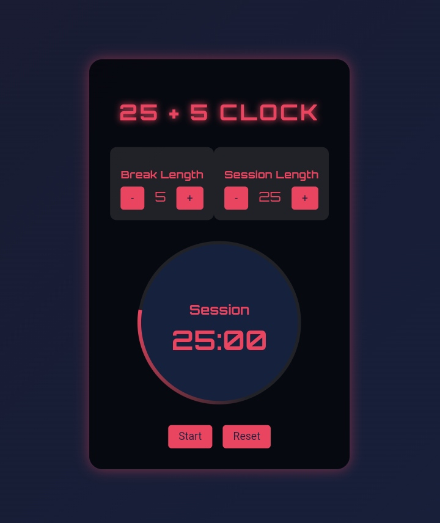

# 25 + 5 Clock

This project is a Pomodoro-style timer application built with React. It allows you to set custom session and break lengths, and it switches between session and break modes automatically. The application also features start/pause functionality and an audio alert when the timer reaches zero.



## Features

- Set custom break and session lengths
- Start and pause the timer
- Audio alert when the timer reaches zero
- Automatic switching between session and break modes
- Responsive design

## Completed Challenge

I have successfully completed the 25 + 5 Clock challenge as part of my learning and development in web development with React.

## How to Use

1. **Adjust Break and Session Lengths:** Use the increment and decrement buttons to set your desired break and session lengths.
2. **Start/Pause the Timer:** Click the "Start" button to begin the timer. Click it again to pause.
3. **Reset the Timer:** Click the "Reset" button to reset the timer to the default values (25 minutes for session and 5 minutes for break).
4. **Audio Alert:** When the timer reaches zero, an audio alert will play, and the timer will switch modes.

## Technologies Used

- React
- JavaScript
- HTML
- CSS

## Installation

1. Clone the repository:

    ```bash
    git clone https://github.com/JohnDev19/25-5-clock.git
    ```

2. Navigate to the project directory:

    ```bash
    cd 25-5-clock
    ```

3. Install dependencies:

    ```bash
    npm install
    ```

4. Start the application:

    ```bash
    npm start
    ```

## License

This project is licensed under the MIT License. See the [LICENSE](LICENSE) file for details.

## Acknowledgments

This project was completed as part of the freeCodeCamp curriculum. Special thanks to the freeCodeCamp community for their support and resources.

## Author

[JohnDev19](https://github.com/JohnDev19)
